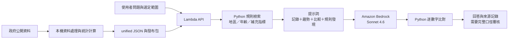

# YouthScope 目前的檢索與生成流程

2026-09-13 程式核對。這是目前實作說明，不是工作坊服務的部署證明。

## 對評審的說法

我們使用自訂的結構化資料檢索增強生成：程式按地區、年齡等規則取出統計記錄，加入趨勢、比較與規則發現，再由 Amazon Bedrock 模型整理回答。產品問答路徑沒有 embedding／向量搜尋，也未串接 Amazon Bedrock Knowledge Bases。另有獨立 Managed Knowledge Base 實驗已完成文件檢索，尚未接入本機或正式問答。未建立 AgentCore Gateway／Harness。

## AWS 分工

|服務|目前職責|不可混稱|
|---|---|---|
|Lambda|執行檢索、提示詞組裝與回答查核|不是Managed Knowledge Base|
|Amazon Bedrock|模型推論|呼叫模型不代表已建立Knowledge Base|
|S3|發布頁面與資料資產；部署包另包含AI所需JSON|普通S3物件不是向量索引|
|DynamoDB|共用模型呼叫節流／lease|不是向量資料庫或青年統計資料庫|
|CloudFront|HTTPS與路由|不做語意檢索|
|CloudWatch|執行日誌|不代表已接AgentCore Observability|

## 程式證據

- `llm/synthesize.py:retrieve`：不接受問題文字，按region、age_group選資料，補其他年齡就業指標、教育與全體家戶記錄，去重後截斷。不做語意相似度搜尋。
- `llm/advise.py:advise`：取記錄並加入洞察、權責、施政規則、區域背景，組成模型上下文。本機新版本另外傳入獨立 `SYSTEM_PROMPT`，採結論、主張、驗證、嚴重度、候選／建議、權責與缺口；`backend.py` 透過 Bedrock Converse 的 system 欄位送出。這項新版本未宣稱已部署正式站。
- `llm/backend.py`：`bedrock-runtime`呼叫模型。
- `deploy/cloudformation.json`：部署S3、Lambda、CloudFront、DynamoDB與IAM等資源，沒有KB、向量索引或AgentCore服務的整合。
- `deploy/lambda_handler.py`：城市JSON供API載入；資料來源不是現場自動向政府API即時查詢。

## 目前限制

检索不是依問句做語意排名，也沒有完整年份篩選。取回／去重／筆數上限可能遺漏資料。逐數字比對不驗證完整的指標、單位、年份、地區與因果。因此只能說具來源上下文，不能宣稱回答已完全查證，相關問題仍交由Webber處理。

## 與工作坊流程的差異

使用者提供的AgentCore手冊描述「文件匯入知識庫、檢索工具、Agent」的工作坊流程。文件存在不代表本專案有呼叫它，也不代表帳號內其他工作坊資源已接到YouthScope。

若未來需要檢索政策PDF、會議紀錄或業務文件，可另規劃文件型Knowledge Base，把文件段落與結構化統計的檢索結果合併。目前已有獨立實驗：`us-west-2` Managed KB `EOPWDZAJRT`，匯入兩份官方公告摘要，完成五次 Retrieve、零次生成。未串接產品問答；文件外問題也會回傳高分，因此還需要答案支持性與拒答驗證。詳細紀錄在 RAG 原型分支的 `experiments/hybrid_rag/CLOUD-RESULTS.md`。

AWS官方參考：https://docs.aws.amazon.com/bedrock/latest/userguide/kb-how-retrieval.html

## 最新架構圖與版本界線

[Archify 互動架構圖](youthscope-current-20260913.html)｜[SVG](youthscope-current-20260913.svg)｜[JSON](youthscope-current-20260913.architecture.json)

正式 AWS 拓撲依 `aws-live-deployment-20260913.json` 既有部署紀錄，這次未重新連線核查。圖中本機新提示詞與 UI 是工作分支；精確 region／age／year／metric 篩選僅屬雙路 RAG 原型，不能回推為既有產品檢索能力。

圖中的「正式 AWS 發布」為部署狀態摘要，並非完整正式拓撲；DynamoDB 共用節流與 CloudWatch 日誌列於配套服務表。統計與問答箭頭呈現程式資料流，獨立 RAG 區塊沒有連到生成端。
