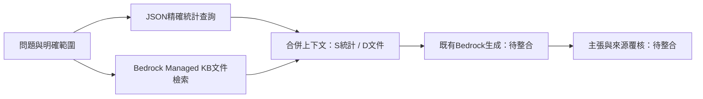

# YouthScope 雙路 RAG 原型（未接正式站）

## 決策

不把所有統計轉向量。精確統計保留結構化查詢；另以文件型知識庫補政策、資格與業務文件。AgentCore是Agent工具與執行架構，不是向量資料庫。Managed Knowledge Base負責文件匯入、索引、向量儲存與檢索，Gateway可將它暴露為MCP工具。固定的問答流程可先直接Retrieve，不必同時導入Gateway/Harness。

現有retrieve沒有year參數，且沒有依問題做語意排名；改用向量不會自動解決年份、單位、分齡、跨城、截斷或來源查核。此原型先把可明確限定的條件固定。

## 原型範圍

- 新增完全獨立的CLI，不修改llm/advise.py、資料、部署設定或正式網站。
- 統計路徑精確限定region、band、year、metric，無資料就空集合。
- 文件路徑支援Bedrock Retrieve的managedSearchConfiguration／vectorSearchConfiguration，須按實際KB型別明確選擇。
- 保留S統計與D文件兩種引用；文件必須有允許清單中的source_url、public access、title、published_at。這是上下文入口限制，不取代IAM或KB權限。
- API錯誤直接失敗，不偽裝成查無資料。內容視為不可信資料，提示詞提醒不執行文件指令；這不保證完全抵禦prompt injection。
- 只輸出證據與待生成提示詞，未串接模型回答與前端引用，不能作正式站替換。

## 執行

```sh
python3 -m unittest discover -s experiments/hybrid_rag -p 'test_*.py' -v
python3 experiments/hybrid_rag/prototype.py --payload data/unified.json \
  --fixture experiments/hybrid_rag/empty-fixture.json \
  --question '新北25-29歲2025年失業率與可用服務？' \
  --region 新北市 --band 25-29 --year 2025 --metric 失業率
```

fixture模式沒有embedding或語意搜尋，不能用來比較召回率。這次以真實專案JSON跑CLI，得到新北25–29、2025失業率0.064，文件狀態no_approved_evidence。

接到已核准的公開文件KB時，改用 `--kb-id <ID> --kb-type managed --allow-source <文件metadata中的完整source_url>`；需要boto3/botocore版本支援managedSearchConfiguration及對該KB的Retrieve權限。CLI不建資源、不匯入文件、不呼叫生成模型。尚未驗證真實AWS連線或KB SDK相容性。

## 實測紀錄與限制

2026-09-13：7項本機測試通過，包含年份/地區/年齡隔離、缺資料不替代、來源限制、去重、guardrail介入、文件/統計分離、兩種API設定及錯誤傳遞。真實JSON的CLI整合測試通過。這是程式契約測試，不是RAG品質評分。

AWS default credentials的GetCallerIdentity回覆InvalidClientTokenId，故未列舉或建立KB、Gateway、Harness，未匯入任何Obsidian私有材料。不得宣稱完成向量資料庫部署。

## 下一階段驗收

1. 指定一小組已核准的公開青年政策/資格文件，保存官方URL、日期、版本、頁碼、適用地區及public標籤。先確認正確文件，不將整個OB匯入。
2. 確認有效憑證、比賽允許服務、KB費用上限與目的bucket，再建立單一測試KB並同步。
3. 準備人工標準答案：精確統計、跨年比較、服務資格、跨局權責、文件外問題、過期政策各類。固定模型、提示詞、問題比較「統計only」和「統計＋文件」。
4. 量測支持答案的段落是否進入top5、引用能否支持主張、數字口徑是否正確、文件外是否拒答、延遲與每次成本。沒有實測前不訂宣稱提升百分比。
5. 文件RAG確有增益再接advise與UI，保留關閉開關。需要多步工具規劃或MCP管理時再加Gateway/Harness。

## 架構



AWS官方依據（2026-09-13讀取）：
- https://docs.aws.amazon.com/bedrock/latest/userguide/kb-how-retrieval.html
- https://docs.aws.amazon.com/bedrock/latest/APIReference/API_agent-runtime_Retrieve.html
- https://docs.aws.amazon.com/bedrock-agentcore/latest/devguide/gateway-target-connector-managed-kb.html
